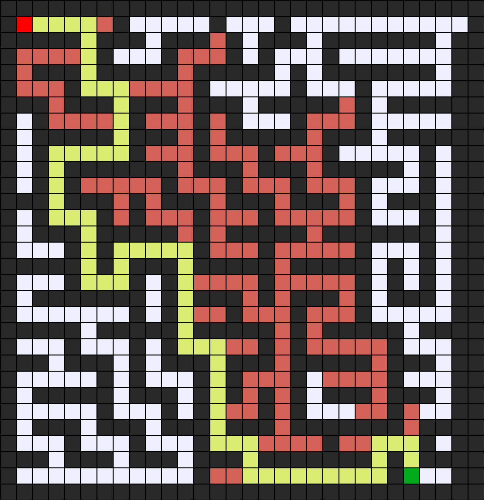

# Maze Solver

This is a Python program to solve mazes using Depth-First Search algorithm.

## Usage

1. Make sure you have Python installed.
2. Run the program with the following command:

    ```bash
    python maze.py maze
    ```

3. Choose one of these methods to solve the maze:
    1) `DFS`
    2) `BFS`
    3) `UCS`
    4) `A*`
    5) `IDA*`
    6) `Greedy Best First Search`

where `maze` is the name of the maze file.

the maze file should be something like this:

```code
###                 #########
#   ###################   # #
# ####                # # # #
# ################### # # # #
#                     # # # #
##################### # # # #
#   ##                # # # #
# # ## ### ## ######### # # #
# #    #   ##B#         # # #
# # ## ################ # # #
### ##             #### # # #
### ############## ## # # # #
###             ##    # # # #
###### ######## ####### # # #
###### ####             #   #
A      ######################
```

And be saved in `.txt` format.

the output image should be like this:

